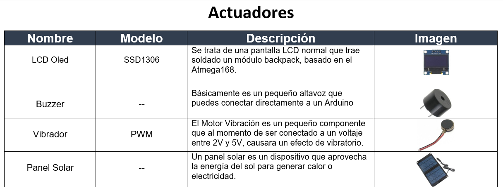
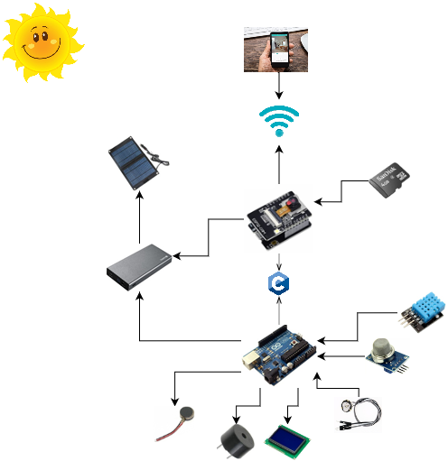

# Desarrollo para  dispositivos inteligentes

## Nombre del Proyecto: Smart Backpack

## Autores

- [Quintero Carrillo Eva - 1217100824](https://github.com/EvaQuintero)
- [Florentino Ramirez Balderas - 1219100383](https://github.com/Florentinorm)
- [Hernández Salazar Diego Joan - 1219100490](https://github.com/DiegoJoan2145)
- [Rodríguez Flores Raúl Alberto- 1219100366](https://github.com/raulrodriguezf)

### Objetivo:

Smart Backpack es una mochila inteligente que mas de alguna vez ayudara en tener una ventaja de mas del 60% de probabilidades de sobrevivir ante una catástrofe. 
- Contará con una cámara en la parte delantera conectada al teléfono celular (SP32-CAM), donde este mismo contará con su propia aplicación móvil donde podrá visualizar lo que está captando la cámara. 
De mismo modo contara con un sensor de Temperatura Y Humedad (DHT11), cuales sus lecturas podrán ser leídas en una LCD (128x64) que estará incorporada en la parte de atrás de la mochila. 
- La mochila contara con un sensor de gas (MQ5), que activará un buzzer en caso de que las lecturas de gas sean altas, en caso de que este no logre ser escuchado por el usuario tendrá incorporado un vibrador (PWM) en la correa de la mochila para que mediante las vibraciones el usuario se dé cuenta de esto. 
- Ya que esta mochila inteligente tendrá incorporado varios sensores, así como el detector de frecuencia cardiaca (HR0214-37) que activará un buzzer en caso de que las lecturas sean altas, en caso de que este no logre ser escuchado por el usuario tendrá incorporado un vibrador (PWM) en la correa de la mochila para que mediante las vibraciones el usuario se de cuenta de esto. 
- Todo este sistema será alimentado por una batería que a su vez esta será alimentada por un conjunto de 5 paneles solares para poder así asegurar su funcionamiento en todo momento.

### Problemática que resuelve:

Hoy en día no estamos seguros de las catástrofes que pudiéramos estar en ellas, tanto como guerras, terremotos, incendios, catástrofes ambientales. Es por ello por lo que siempre debemos de estar resguardados y sobre todo protegidos por nuestra seguridad y de nuestras personas mas cercanas. 
Es por ello por lo que llega Smart Backpack la cual con ella planeamos enfrentarnos a diferentes problemáticas que pudiesen existir, por ejemplo, estas son algunas de estas:
- Con la cámara planemos poder grabar aquellas situaciones donde corra peligro, prácticamente ara la función de las cámaras de seguridad para grabar todos aquellos hechos que pueden pasar, y esta contara con su aplicación móvil donde vera todo lo captado por la cámara, también esta se guardaran en una memoria sd para un mejor almacenamiento de estos contenidos. 
- El sensor de temperatura y humedad planea advertir al portador de elevaciones altas con un tiempo de anticipación antes de que esto suceda, para que este mismo se pueda percatar de este echo y corra a buscar un mejor sitio que se encuentre en mejores condiciones.
- El sensor de gas advertirá al portador de una posible fuga de gas, ya que estas llevan consigo una fuerte explosión o incendio, que pudiera poner en peligro a la persona. 
- El detector de la frecuencia cardiaca advertirá al portador en una elevación de pulsaciones por minutos el cual ayudará a prevenir un posible paro cardiaco, y salvándole la vida. 
- Al ser una mochila esta contara con paneles solares lo cual ayudara a la alimentación de todos los sensores y evitara que este se quede sin energía en caso de una emergencia ya que también podrá cargar los dispositivos móviles.

### Epicas:
- 

### Trello:

### Materiales:

### Diagrama de componente

