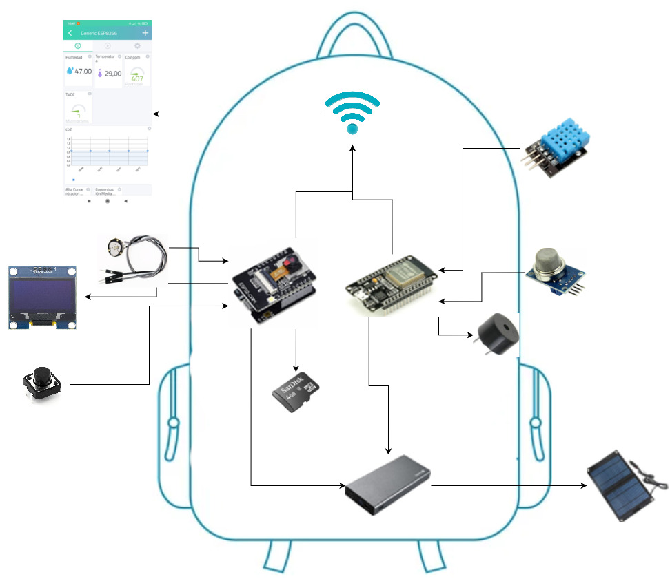

# Desarrollo para  dispositivos inteligentes

## Nombre del Proyecto: Smart Backpack

## Autores

- [Quintero Carrillo Eva - 1217100824](https://github.com/EvaQuintero)
- [Florentino Ramirez Balderas - 1219100383](https://github.com/Florentinorm)
- [Hernández Salazar Diego Joan - 1219100490](https://github.com/DiegoJoan2145)
- [Rodríguez Flores Raúl Alberto- 1219100366](https://github.com/raulrodriguezf)

### Objetivo:

Smart Backpack es una mochila inteligente que mas de alguna vez ayudara en tener una ventaja de mas del 60% de probabilidades de sobrevivir ante una catástrofe. 
- Contará con una cámara en la parte delantera conectada al teléfono celular (SP32-CAM), donde este mismo contará con su propia aplicación móvil donde podrá visualizar lo que está captando la cámara. 
De mismo modo contara con un sensor de Temperatura Y Humedad (DHT11), cuales sus lecturas podrán ser leídas en una LCD (128x64) que estará incorporada en la parte de atrás de la mochila. 
- La mochila contara con un sensor de gas (MQ5), que activará un buzzer en caso de que las lecturas de gas sean altas, en caso de que este no logre ser escuchado por el usuario tendrá incorporado un vibrador (PWM) en la correa de la mochila para que mediante las vibraciones el usuario se dé cuenta de esto. 
- Ya que esta mochila inteligente tendrá incorporado varios sensores, así como el detector de frecuencia cardiaca (HR0214-37) que activará un buzzer en caso de que las lecturas sean altas, en caso de que este no logre ser escuchado por el usuario tendrá incorporado un vibrador (PWM) en la correa de la mochila para que mediante las vibraciones el usuario se de cuenta de esto. 
- Todo este sistema será alimentado por una batería que a su vez esta será alimentada por un conjunto de 5 paneles solares para poder así asegurar su funcionamiento en todo momento.

### Problemática que resuelve:

Hoy en día no estamos seguros de las catástrofes que pudiéramos estar en ellas, tanto como guerras, terremotos, incendios, catástrofes ambientales. Es por ello por lo que siempre debemos de estar resguardados y sobre todo protegidos por nuestra seguridad y de nuestras personas mas cercanas. 
Es por ello por lo que llega Smart Backpack la cual con ella planeamos enfrentarnos a diferentes problemáticas que pudiesen existir, por ejemplo, estas son algunas de estas:
- Con la cámara planemos poder grabar aquellas situaciones donde corra peligro, prácticamente ara la función de las cámaras de seguridad para grabar todos aquellos hechos que pueden pasar, y esta contara con su aplicación móvil donde vera todo lo captado por la cámara, también esta se guardaran en una memoria sd para un mejor almacenamiento de estos contenidos. 
- El sensor de temperatura y humedad planea advertir al portador de elevaciones altas con un tiempo de anticipación antes de que esto suceda, para que este mismo se pueda percatar de este echo y corra a buscar un mejor sitio que se encuentre en mejores condiciones.
- El sensor de gas advertirá al portador de una posible fuga de gas, ya que estas llevan consigo una fuerte explosión o incendio, que pudiera poner en peligro a la persona. 
- El detector de la frecuencia cardiaca advertirá al portador en una elevación de pulsaciones por minutos el cual ayudará a prevenir un posible paro cardiaco, y salvándole la vida. 
- Al ser una mochila esta contara con paneles solares lo cual ayudara a la alimentación de todos los sensores y evitara que este se quede sin energía en caso de una emergencia ya que también podrá cargar los dispositivos móviles.

### Epicas:

#### Epicas - Sprint 2

| id | Actividad   | Priorización                      |
| :- | :---------- | :-------------------------------- |
| 2.0| Grabación de video y almacenado en una SD | Deberia |
| 2.1| Implementación del sensor de **DHT11**  | Deberia |
|2.2| Implementación de la pantalla **EW162B0YMY** | Deberia |
| 2.3| Implementación del sensor de **HR0214-37**  | Deberia |
| 2.4| Estructura de la base de datos  | Deberia |
| 2.5| Diagrama de modelado circuito electrónico.  | Deberia |
| 2.6| Implementación del actuador **Buzzer**  | Deberia |

#### Epica Extra - Sprint 2

| id | Actividad   | Priorización                      |
| :- | :---------- | :-------------------------------- |
| 2.7| Implementación del sensor de **MQ5**  | Deberia |
|2.8| Implementación de una aplicación web, para mostrar los datos del sensor **DHT11** | Deberia |
| 2.9| Implementación de un led, para mostrar las lecturas del sensor **HR0214-37** | Deberia |

#### Funcionamiento
Con este nuevo sprint, se realizó la incorporación de nuevas funciones, sensores, así como nuevos actuadores, entre ellos están: 
- **Grabación de video y almacenado en una SD**, Se podrá grabar un video desde la ESP32-CAM. El usuario podrá almacenar el video del entorno en una sd, mediante la interfaz que proporciona la ESP32-CAM
- **DHT11**, Sensor de temperatura y humedad. El sensor actuará obteniendo información en función de la humedad relativa del área. Se probará, aplicando dos situaciones: 1° Acercar la flama del encendedor, 2° leer los datos desde la aplicación web.
- **HR0214-37**, Sensor de frecuencia cardiaca. El sensor será capaz de medir el pulso cardiaco del usuario. Para probarlo, se mostrarán los resultados obtenidos a través de la consola, de mismo modo encendera un led con el ritmo de la frecuencia cardiaca.
- **SSD1306**, Pantalla lcd de 16x2. En esta se mostrará la frecuencia cardiaca recabada por el usuario. Para probarlo deberíamos de ver las lecturas mostradas en la lcd, de misma manera un led encendera al ritmo de la frecuencia cardiaca. 
- Estructura de la base de datos. Se creará el diagrama de la base de datos donde se guardarán los datos que se generen con el sensor de frecuencia cardiaca. [Estructura de la base de datos](https://3puntozeromktblog.files.wordpress.com/2015/03/estamos-trabajando-contenidos-web2.jpg)
- Diagrama de modelado circuito electrónico. Se diseñará el diagrama del circuito de los componentes a utilizar, incluyendo los sensores y actuadores. [Diagrama de modelado circuito electrónico](https://3puntozeromktblog.files.wordpress.com/2015/03/estamos-trabajando-contenidos-web2.jpg)
- **Buzzer**, El Buzzer actuará mediante la respuesta del sensor de gas. El usuario será capaz de escuchar un sonido de alerta, cuando exista la presencia de un gas detectado previamente con el sensor, ademas de hacer sonar el **Buzzer** cuando la lectura sea igual o mayor a 500.
- **MQ5**, Sensor de Gas. El sensor funcionará a través de señales eléctricas cuando se detecte un gas. Se probará su funcionamiento mediante la manipulación con un gas natural, detectando su valor e imprimiendo el resultado mediante la consola.

### Tablero en Trello:
[Smart Backpack](https://trello.com/b/vkpyq9oI/smart-backpack)

### Materiales:

### Esquemas

### Diagrama de componente

### Dibujo del prototipo terminado
